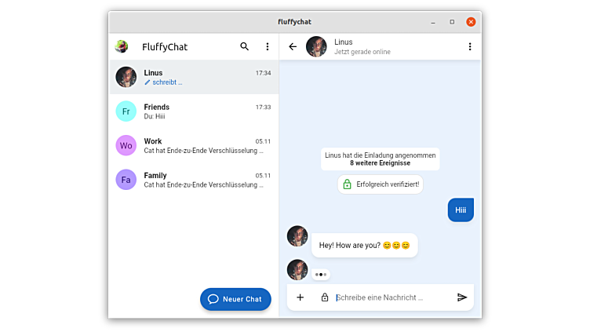

<!--
Este archivo README esta generado automaticamente<https://github.com/YunoHost/apps/tree/master/tools/readme_generator>
No se debe editar a mano.
-->

# Fluffychat para Yunohost

[](https://ci-apps.yunohost.org/ci/apps/fluffychat/)


[](https://install-app.yunohost.org/?app=fluffychat)

*[Leer este README en otros idiomas.](./ALL_README.md)*

> *Este paquete le permite instalarFluffychat rapidamente y simplement en un servidor YunoHost.*  
> *Si no tiene YunoHost, visita [the guide](https://yunohost.org/install) para aprender como instalarla.*

## Descripción general

FluffyChat is an open source, nonprofit and cute [[matrix](https://matrix.org)] client written in [Flutter](https://flutter.dev).  
The goal of the app is to create an easy to use instant messenger which is open source and accessible for everyone.


**Versión actual:** 1.25.1~ynh1

**Demo:** <https://fluffychat.im/web>

## Capturas



## Documentaciones y recursos

- Sitio web oficial: <https://fluffychat.im/>
- Documentación usuario oficial: <https://github.com/krille-chan/fluffychat/wiki#-user-guides>
- Repositorio del código fuente oficial de la aplicación : <https://github.com/krille-chan/fluffychat>
- Catálogo YunoHost: <https://apps.yunohost.org/app/fluffychat>
- Reportar un error: <https://github.com/YunoHost-Apps/fluffychat_ynh/issues>

## Información para desarrolladores

Por favor enviar sus correcciones a la [rama `testing`](https://github.com/YunoHost-Apps/fluffychat_ynh/tree/testing).

Para probar la rama `testing`, sigue asÍ:

```bash
sudo yunohost app install https://github.com/YunoHost-Apps/fluffychat_ynh/tree/testing --debug
o
sudo yunohost app upgrade fluffychat -u https://github.com/YunoHost-Apps/fluffychat_ynh/tree/testing --debug
```

**Mas informaciones sobre el empaquetado de aplicaciones:** <https://yunohost.org/packaging_apps>
